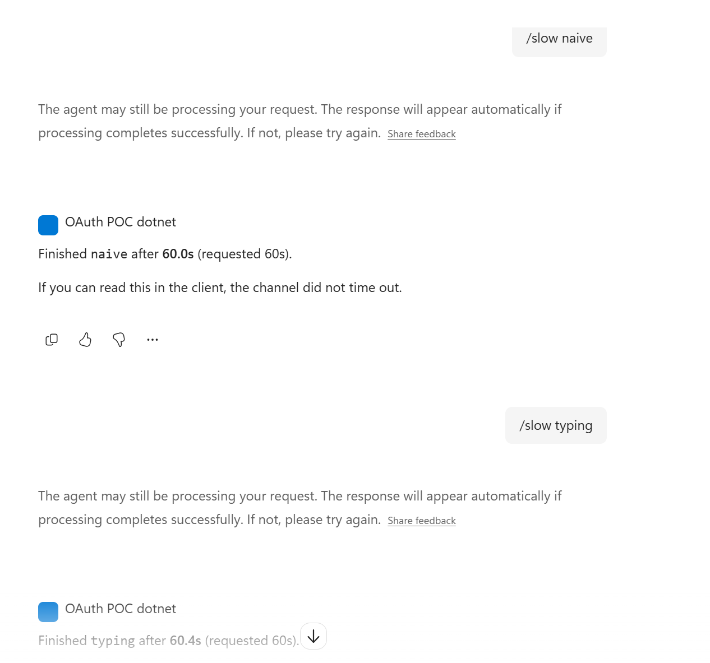
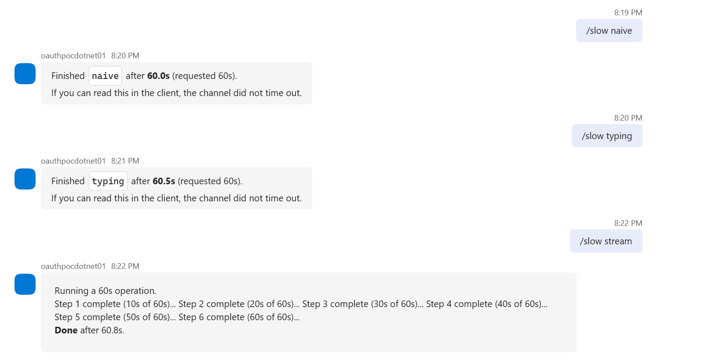
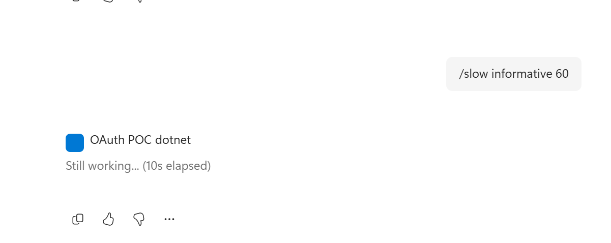
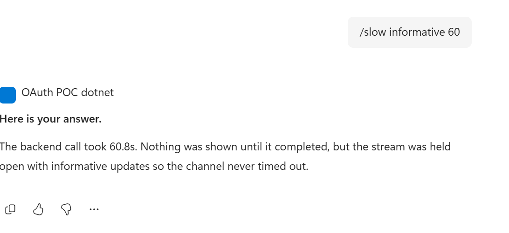
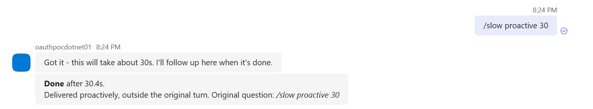

# Copilot citation & timeout labs

A minimal custom engine agent (CEA) that answers two questions empirically, on the
surface where they actually matter:

1. **Why is my `[1]` citation not clickable when the answer is an Adaptive Card?**
2. **Why does my agent time out in Microsoft 365 Copilot but not in Teams?**

Everything here was measured on **Microsoft.Agents 1.5.184**, running in **Microsoft 365
Copilot** and **Teams** from the same deployment, so the only variable is the surface.

There is no authentication, no storage and no business logic in this sample. The labs
are deliberately isolated so the behaviour they demonstrate cannot be blamed on anything
else in the app.

---

## Results

| Test | Teams (60s) | Microsoft 365 Copilot (60s) |
|---|---|---|
| `/slow naive 60` — block, then reply | completes cleanly | **timeout notice**, answer arrives after |
| `/slow typing 60` — typing indicator, then block | completes cleanly | **timeout notice**, answer arrives after |
| `/slow stream 60` — streamed text chunks | completes cleanly | **clean** |
| `/slow informative 60` — heartbeat updates, answer at end | completes cleanly | **clean** |
| `/slow proactive 60` — ack, then deliver out-of-turn | completes cleanly | **clean** |
| `/cite card` — `[1]` inside the Adaptive Card | not clickable | **not clickable** |
| `/cite both` — `[1]` in message `Text`, card attached | clickable | **clickable** |

---

## Finding 1 — citations anchor to message `Text`, not to card content

A correctly-built citation entity is **not sufficient**. If the activity has no `Text`,
there is nothing for the citation to bind to and the `[n]` marker renders as dead
literal text — no matter how well-formed the entity is.

`/cite card` sends a fully valid, SDK-built `AIEntity` with the marker inside a card
`TextBlock`. It never renders as clickable. `/cite both` sends the **same card** with the
marker moved into the message `Text`, and it renders clickable on both surfaces.

So the attachment is irrelevant. The absence of `Text` is the defect.

```csharp
// BEFORE — marker lives inside the card, message Text is empty. Never clickable.
var activity = new Activity
{
    Type = ActivityTypes.Message,
    Attachments = [employeeTableCard]      // card contains a TextBlock "... [1]"
};

// AFTER — marker in message Text; the card is unchanged apart from dropping the marker.
var activity = MessageFactory.Text("Here are the active employees, from the employee directory [1]");
activity.Attachments = [employeeTableCard];

activity.Entities ??= [];
activity.Entities.Add(new AIEntity
{
    AdditionalType = [AIEntity.AdditionalTypeAIGeneratedContent],
    Citation =
    [
        new ClientCitation
        {
            Position = 1,
            Appearance = new ClientCitationAppearance
            {
                Name     = "Employee directory — HR system",
                Url      = "https://example.com/directory",
                Abstract = "Active employee roster, refreshed nightly."
            }
        }
    ]
});
```

If you stream instead, `StreamingResponse.AddCitation(...)` builds the entity for you —
but the `[n]` marker must still appear in the **streamed text**, because the SDK resolves
which citations were used by scanning the accumulated message text.

Do **not** hand-set a `botCitations` property based on what you see in a HAR. That is the
channel's internal representation, not the developer API.

---

## Finding 2 — the 45-second budget is real, and it is Copilot-only

The documented contract is two separate limits:

> Each user query should receive an **initial response within 15 seconds**. For
> long-running tasks, agents can send follow-up messages. **A 45-second timeout applies
> between streaming updates.**

A single reply that takes 40 seconds is already outside the guidance even though it beats
45 seconds.

**In Teams, a 60-second blocking turn completes silently with no warning at all.** The
same code, same deployment, in Copilot produces a client-side timeout notice at roughly
45 seconds:



The same run in Teams, for comparison — no notice, no complaint:



If your team has been validating in Teams, you will not reproduce this. Test in Copilot.

Note the second half of the Copilot screenshot: **a typing indicator does not reset the
clock.** `/slow typing 60` sends typing at +0.5s and still trips the notice. This is the
first fix most teams reach for, and it does not work.

### What works when you have nothing to show yet

`/slow stream` streams real text chunks, which is fine if your agent produces tokens
progressively. Many agents don't — they make one long backend call and then format an
answer. For that shape, hold the stream open with informative updates and deliver the
answer at the end.

In progress — the heartbeat is the visible message, and it updates in place:



On completion, the heartbeat is replaced by the real answer. No timeout notice, and
nothing fabricated in the final message:



```csharp
var stream = turnContext.StreamingResponse;

await stream.QueueInformativeUpdateAsync("Working on it...", ct);   // lands immediately

while (workStillRunning)
{
    // Heartbeat at least every ~10s. Repeated informative updates are explicitly
    // supported; the SDK only rejects them after EndStreamAsync.
    await stream.QueueInformativeUpdateAsync("Still working...", ct);
}

// Only now is there anything to say. This is the entire visible answer.
stream.QueueTextChunk(finalAnswer);
await stream.EndStreamAsync(ct);
```

Two caveats, both from `StreamingResponse.cs` in 1.5.184:

1. `QueueInformativeUpdateAsync` returns immediately and does nothing when
   `IsStreamingChannel` is `false`. On a non-streaming channel there is no heartbeat and
   you are back to the blocking case.
2. You must queue at least one real text chunk before `EndStreamAsync`. With no chunks,
   the final message becomes `"No text was streamed"` with `StreamResults.Error`.

### For work that can exceed a minute

Acknowledge inside the turn and deliver via the proactive pattern. This is the only
option with no upper bound.



```csharp
// Capture what you need NOW — the ITurnContext is disposed when the turn ends.
var identity  = turnContext.Identity;
var adapter   = turnContext.Adapter;
var reference = turnContext.Activity.GetConversationReference();

await turnContext.SendActivityAsync("Got it — I'll follow up here when it's done.", ct);

_ = Task.Run(async () =>
{
    var result = await DoLongWorkAsync();     // no turn, no budget

    await adapter.ProcessProactiveAsync(
        identity,
        reference.GetContinuationActivity(),
        audience: null,
        callback: async (ctx, ct2) => await ctx.SendActivityAsync(result, ct2),
        CancellationToken.None);
}, CancellationToken.None);
```

---

## A trap in the proactive path: inherited `ReplyToId`

`ConversationReference.GetContinuationActivity()` sets `Id = ActivityId ?? Guid.NewGuid()`,
so the seeded turn inherits the **original** activity id. Every reply sent from that turn
then gets `ReplyToId` = that original id, because `TurnContext.SendActivitiesAsync` calls
`ApplyConversationReference`, whose outgoing branch does `ReplyToId = reference.ActivityId`.

The same applies to a sign-in flow resuming from a banked continuation activity: the
incoming branch is `Id ??= reference.ActivityId`, so a banked activity **keeps its id**.

Usually harmless — the parent is a real user message. It stops being harmless when the
banked activity is something the user never saw, such as a `conversationUpdate`. The
reply is then threaded to an invisible parent: the bot really did send an answer, the
send really did succeed, and nothing appears in the UI.

`OutboundTrace.cs` logs this on every outbound activity so you can see it directly:

```text
[outbound] POST type=message replyToId=1786418656506 assignedId=... conv=...
[outbound] clearing stale replyToId=1786418656506
```

If the traced `replyToId` is not the id of the user's most recent message, you are
threading to a stale parent. `OutboundTrace.DetachFromStaleParent(...)` clears it so the
result posts as a new message instead.

---

## What's in here

| File | Purpose |
|---|---|
| `src/CitationLab.cs` | The four citation shapes (`/cite`) |
| `src/LongRunningLab.cs` | The five timeout strategies (`/slow`) |
| `src/OutboundTrace.cs` | Logs `ReplyToId` on every outbound activity |
| `src/LabsAgent.cs` | Route wiring — ~90 lines, no business logic |
| `src/AspNetExtensions.cs` | JWT validation helper, copied verbatim from the official SDK samples (MIT) |

`CitationLab.cs`, `LongRunningLab.cs` and `OutboundTrace.cs` are self-contained and can be
dropped into an existing agent independently of each other.

---

## Running it

Requires an Azure Bot registration with a messaging endpoint pointing at
`https://<your-host>/api/messages`, and the app installed in Teams and/or Copilot.

```bash
cd src
cp appsettings.json appsettings.Development.json   # fill in the placeholders
dotnet run
```

Container:

```bash
docker build -t copilot-labs .
docker run -p 8080:8080 copilot-labs
```

Fill in `TokenValidation.Audiences`, `TokenValidation.TenantId`, and the
`Connections.ServiceConnection.Settings` client id/secret with your bot registration
values.

---

## Commands

| Command | What it does |
|---|---|
| `/surface` | Report channel, sub-channel, and whether streaming is supported |
| `/cite text` | Message `Text` with `[1]` + citation entity (control) |
| `/cite card` | Adaptive Card only, `[1]` inside a `TextBlock` — **the broken shape** |
| `/cite both` | `[1]` in message `Text` **and** card attached — **the fix** |
| `/cite stream` | Streamed response with `AddCitation` + `FinalMessage` |
| `/slow naive <sec>` | Block, then reply once |
| `/slow typing <sec>` | Typing indicator, then block |
| `/slow stream <sec>` | Streamed text chunks |
| `/slow informative <sec>` | Heartbeat informative updates, answer only at the end |
| `/slow proactive <sec>` | Acknowledge, then deliver out-of-turn |

`/surface` is the quickest way to confirm which surface you are on: Microsoft 365 Copilot
reports `subChannel = COPILOT`, Teams reports none.

---

## Other SDK notes for 1.5.184

- `IStreamingResponse` has **no `AddAttachment`** in this version. To put a card on a
  streamed message you must set `FinalMessage` — and `CreateFinalMessage` only
  auto-populates `Text` when `FinalMessage` is `null`, so setting it will **silently drop
  your streamed text** unless you carry it across yourself. See `CitationLab.cs`.
- Citations are capped at 20 per message.
- Adaptive Cards are not rendered inside the citation pop-up itself.

## References

- [Add citations to agent messages](https://learn.microsoft.com/en-us/microsoftteams/platform/bots/how-to/bot-messages-ai-generated-content#add-citations)
- [Streaming UX for bots](https://learn.microsoft.com/en-us/microsoftteams/platform/bots/streaming-ux)
- [Asynchronous flow for custom engine agents](https://learn.microsoft.com/en-us/microsoft-365/copilot/extensibility/custom-engine-agent-asynchronous-flow)
